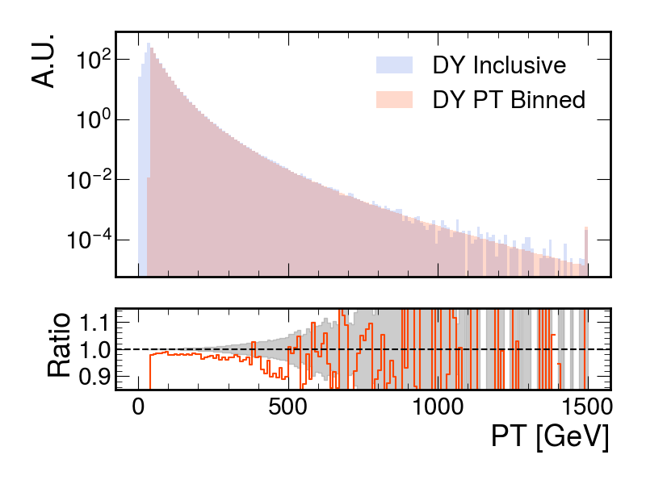

# lhe_cek scripts

In this repository, you can find the scripts necessary to run the checks on pt-binned samples.

## How to use

You have to run the scripts in the following sequence:

``
run.py -> plot.py -> stack.py
``

### `run.py`

The `run.py` script is used to process various samples which can be passed as input either by explicitly listing them when calling the script or by using a `.txt` file.

The script saves a rootfile per input, containing only the `pt`, `mass`, and `weight` branches.

You should adapt the redirector based on the region you are in and the output path to your desired folder.

Please note that since you may have to process a lot of files, it is recommended to set the output to somewhere you have at least a few GB of disk space.

### `plot.py`

The `plot.py` script reads the files produced by `run.py`, creates histograms of the variables, and saves them in `.npz` format.

The list of samples to process must be specified at the end of the script; currently, some DY samples are provided as a starting point for studies.

Always remember to change the path to whatever you prefer.

If you want to produce histograms with different binning, adjust the bin definitions in this script, along with the output folder.

### `stack.py`

The `stack.py` script stacks the histograms and plots them.

The only caveat is to set the path correctly.

## An example

Using the files defined at the end of `plot.py`, you should be able to produce something like this:

